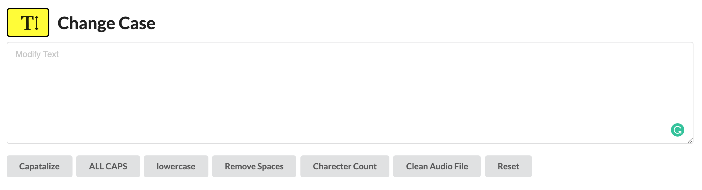

[https://rickyhaswifi.github.io/Text-tools/](https://rickyhaswifi.github.io/Text-tools/)
 

# Text Tools using Javascript & REGEX

* Capitalize
* ALL CAPS
* lowercase
* RemoveSpaces
* Charecter Counter
* Remove track number, text after '-' and file extension

## Example input for Clean Audio File
01 Ghost Of You - My Chemical Romance.wav 
02 Montauk - Bayside.wav 
03 Helena - My Chemical Romance.wav 
04 Duality - Bayside.wav 
05 Welcome To The Black Parade - My Chemical Romance.wav 
06 Interrobang - Bayside.wav 
07 Famous Last Words - My Chemical Romance.wav 
08 Landing Feet First - Bayside.wav 
09 The Ghost Of You - My Chemical Romance.wav 
10 Already Gone - Bayside.wav 

## Returns output

Ghost Of You 
Montauk 
Helena 
Duality 
Welcome To The Black Parade 
Interrobang 
Famous Last Words 
Landing Feet First 
The Ghost Of You 
Already Gone